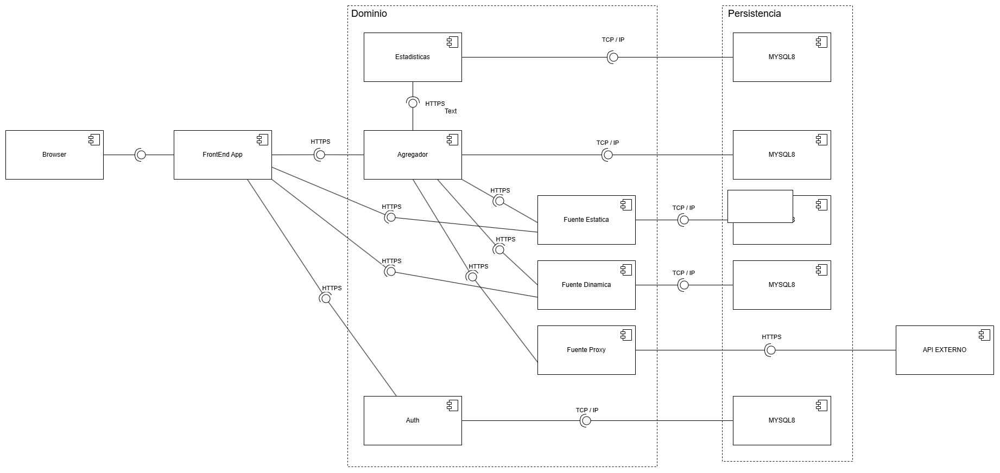

# MetaMapa - Sistema de Mapeo Colaborativo

**MetaMapa** es una plataforma de código abierto diseñada para la recopilación, visibilización y mapeo colaborativo de información geolocalizada. Este proyecto permite a comunidades y organizaciones gestionar eventos (hechos) en tiempo y espacio, potenciando la inteligencia colectiva para causas sociales, ambientales o de seguridad.

Desarrollado como parte del **Trabajo Práctico Anual de Diseño de Sistemas de Información (DDS) - UTN FRBA**.

## 🏗️ Arquitectura del Sistema

El sistema implementa una **Arquitectura de Microservicios** desacoplada, utilizando comunicación **REST** entre todos sus componentes para garantizar la modularidad y el cumplimiento de los requerimientos de la cátedra.

### Diagrama de Arquitectura

#### Flujo de Componentes:
1.  **Frontend (Client Liviano):** Desarrollado con **Spring Boot + Thymeleaf**. Utiliza **Server Side Rendering (SSR)** para la presentación de datos, comunicándose exclusivamente con el servicio Agregador.
2.  **Servicio Agregador:** Actúa como orquestador central. Consolida la información proveniente de las distintas fuentes y aplica la lógica de **Consenso** (Curada/Irrestricta).
3.  **Fuentes de Datos:**
    * **Fuente Dinámica:** Gestiona aportes directos de usuarios (registrados o anónimos).
    * **Fuentes Proxy:** Integración con otras instancias de MetaMapa.
    * **Importador CSV:** Procesamiento masivo de hechos (+10,000 registros).
4.  **Servicio de Estadísticas:** Microservicio independiente que consume datos para generar reportes y métricas.
5.  **Servicio Auth:** Encargado de la autenticación y autorización.
---

## 🔐 Seguridad y Control (Spring Security)

La robustez y el control de acceso del sistema se gestionan mediante **Spring Security**, cubriendo aspectos críticos de seguridad:

* **Autenticación SSO:** Integración con protocolos de **Single Sign-On** para una gestión de identidad centralizada.
* **Control de Acceso:** Definición de roles y permisos (Admin, Contribuyente, Visualizador).
* **Rate Limiting:** Protección de los recursos frente a abusos o sobrecargas mediante limitación de solicitudes.
* **Filtros de Red:** Control de acceso por **IP (Whitelisting/Blacklisting)** para bloquear tráfico no confiable.
* **Prevención de Spam:** Algoritmo **TF-IDF** integrado para el filtrado automático de contenido malicioso.

---

## 🚀 Características Técnicas

* **Renderizado SSR:** Uso de **Thymeleaf** para generar vistas dinámicas del lado del servidor.
* **Geolocalización:** Gestión y visualización de hechos en mapas.
* **Persistencia:** Bases de datos relacionales independientes por servicio (JPA/Hibernate).
* **Búsqueda Avanzada:** Implementación de búsqueda por texto libre.

---

## 🛠️ Stack Tecnológico

* **Lenguaje:** Java 21
* **Framework Principal:** Spring Boot 3.x
* **Seguridad:** **Spring Security (OAuth2 / SSO)**
* **Motor de Plantillas:** Thymeleaf (SSR)
* **Comunicación:** APIs REST (JSON)
* **Persistencia:** MySQL (JPA)
* **Control de Versiones:** Git (Git Flow)

---

## 📈 Mejoras a considerar

Si bien el proyecto cumple con los objetivos académicos, se identifican las siguientes evoluciones para una arquitectura de microservicios de producción:

* **Service Registry (Eureka/Consul):** Para permitir el descubrimiento dinámico de instancias y eliminar el hardcoding de URLs entre servicios.
* **API Gateway (Spring Cloud Gateway):** Para centralizar el ruteo, la autenticación y el manejo de logs en un único punto de entrada.
* **Contenerización (Docker):** Para estandarizar el despliegue de los distintos servicios.
* **Mensajería Asincrónica:** Migración del servicio de estadísticas a un modelo basado en eventos (ej. RabbitMQ) para mayor desacoplamiento.

---

## 📋 Entregas del Proyecto (Hitos)

1.  **Modelo de Dominio:** Lógica de geolocalización.
2.  **Integración:** Fuentes Proxy y filtros de Spam.
3.  **UX/UI & REST:** Wireframes y exposición de endpoints.
4.  **Persistencia:** ORM y Servicio de Estadísticas.
5.  **Arquitectura Web MVC:** Cliente Liviano con SSR e integración SSO.
6.  **Seguridad Avanzada:** Implementación de Rate Limiting, control de IPs y microservicios.

---

## 👥 Autores
* Ezequiel Arroyo - [@EzequielArroyo](https://github.com/EzequielArroyo)
* Ivan Converso - [@ivan_sxs](https://github.com/ivan_sxs)
* Agustin Corro Molas - [@acorromolas11](https://github.com/acorromolas11)
